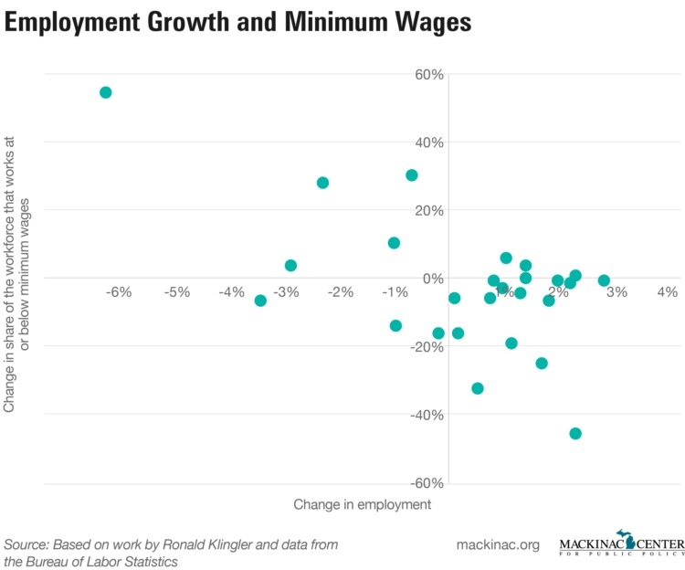
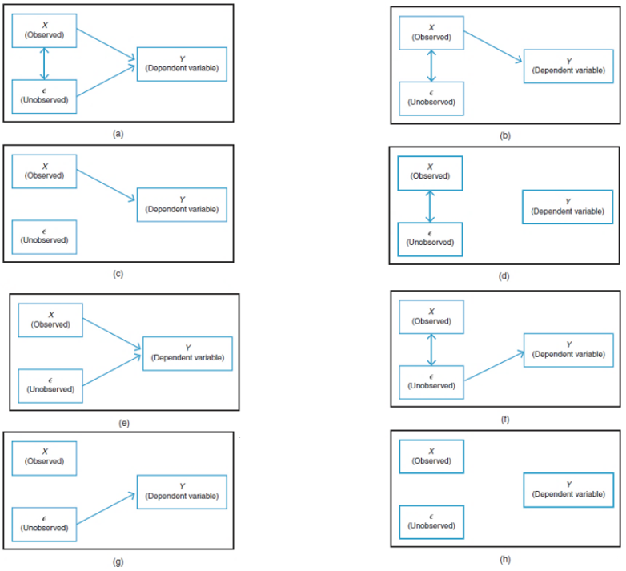

```{r setup, include=FALSE}
options(htmltools.dir.version = FALSE) 
knitr::opts_chunk$set(echo = FALSE, dev.args = list(png = list(type = "cairo")), warning = FALSE, message = FALSE, fig.width = 8, fig.height = 6)
library(tidyverse)
library(directlabels)
library(ggdag)
theme_metro <- function(x) {
  theme_minimal() + 
  theme(panel.background = element_rect(color = '#FAFAFA',fill='#FAFAFA'),
        plot.background = element_rect(color = '#FAFAFA',fill='#FAFAFA'),
        text = element_text(size = 16),
        axis.title.x = element_text(hjust = 1),
        axis.title.y = element_text(hjust = 1, angle = 0))
}
theme_metro_regtitle <- function(x) {
  theme_minimal() + 
  theme(panel.background = element_rect(color = '#FAFAFA',fill='#FAFAFA'),
        plot.background = element_rect(color = '#FAFAFA',fill='#FAFAFA'),
        text = element_text(size = 16))
}
```

# Welcome to Econometrics

- This is econometrics
- Econometrics is a field that covers how economists think about statistical analysis
- Many other social science fields (and fields like epidemiology) have picked up econometric tools as well becuase of how useful they tend to be

---

# Welcome to Econometrics

- So what is econometrics?
- Econometrics focuses on the study of *observational data*
- Observational data are measurements of things that *the researcher does not control*
- Given that we are working with observational data, we still want to understand the *causes of things*
- The world is what it is, we are only here to study it

---

# Welcome to Econometrics

- When is this useful?
- We can't randomly assign or experiment with things like how much education you get, or what our tax rates are, or what a stock's recent returns have been, or where you live - that would generally be impossible or cruel
- But we still want to learn about the *underlying patterns* related to those data - how does X cause Y? What is the correct model to use to understand X and Y?
- That would be simple if we could control the situation, turn things on and off, randomize stuff
- But we can't! So what now? Enter econometrics.

---

# Welcome to Econometrics

- This is a great course (if I do say so)
- When I took it, what it left me feeling was *powerful*
- It gave me the ability to answer questions I was interested in on my own
- And to understand the degree of confidence I could have in my own results and in others
- "A new study says..." you don't need to take the paper's word for that any more!

---

# Admin

- Review the syllabus (and other materials on Canvas). Reading assignments there
- Our textbook is Bailey's Real Econometrics. Read Chapters 1 and 2 this week!
- Also these slides
- Programming in R: free, you will want to have access to it. We will get to this next time
- Assignments: Weekly homework combining Bailey and R tasks
- There is a midterm and a final
- A data exploration project
- A group data analysis project
- And completion of Swirl modules and online discussion

---

# Causality and Prediction

- Okay so what are we doing here exactly?
- In econometrics, we are working with data
- Statisticians also work with data
- So do data scientists
- The *goals* for these groups differ considerably

---

# Causality and Prediction

- Data scientists are generally concerned with *prediction*
- They want to use the data at hand to *predict* what comes next
- They generally don't care *why* they're making the prediction they are
- This can be really handy for certain tasks - "is this picture a cat or a dog?" "what's the probability that a customer with qualities X, Y, and Z will end up purchasing our good?" "do you have lymphoma?"

---

# Causality and Prediction

- Econometricians, on the other hand, care almost exclusively about *why*
- Data scientists want to minimize *prediction error*
- Econometricians want to minimize *inference* and *identification error*
- We want to correctly understand *the underlying data generating process*

---

# Inference Error and Randomness

- One big problem we face when trying to figure out how variables relate to each other is *randomness*
- This is simply the fact that, when we gather data, we can only possibly get a subsample of *all* the data
- So, just by random chance, the relationship we get in our data might not be quite the same as the true relationship

---

# Inference Error and Randomness

- So if we look in a data set and see that $X$ and $Y$ appear to be positively related to each other...
- Are they actually positively related, or is that just random chance?
- If they are positively related, maybe we're understating or overstating *how* positively related

---

# Inference Error and Randomness

- If the true relationship is 0, then in the data we'll see a positive relationship half the time, and a negative relationship half the time
- Even though the truth is 0!
- How can we properly make an *inference* about whether the relationship is 0 or not (or positive, or negative, or *how* positive or negative), taking into account this randomness?
- That's being careful about inference. The statisticians teach us all about this!


---

# Identification Error

- What is identification error?
- *Identification* is how you link the *result you see* with the *conclusion you draw from it*
- For example, say you observe that kids who play video games are more aggressive in everyday life (result), and you conclude from that result that video games make kids more aggressive (conclusion)
- If *seeing that result is actually evidence for that conclusion*, then we are properly *identified*

---

# Identification Error

- But if there's another reason why we might see that result, i.e. if the same result could give us a different conclusion, like *kids who are aggressive play more video games* or *people notice aggression more when kids play video games*, then we have made an *identification error* - our result was not identified!
- Identification error is when your result in the data doesn't actually have a clear theoretical ("why" or "because") interpretation
- For example, if you observe that people tend to wear more shorts on days they eat more ice cream, and you conclude that eating ice cream makes you put on shorts, you have committed an identification error
- One day in and all we can do is complain, eesh

---

# Data Generating Process

- To avoid identification error, economists think closely about the *data generating process*
- What is a data generating process?
- The data generating process is the *true set of laws* that determine where our data comes from
- For example, if you hold a rock and drop it, it falls to the floor
- What is the data we observe? (Hold the rock & Rock is up) and (Let go & Rock is down)
- What is the data generating process? Gravity makes the rock fall down when you drop it

---

# Data Generating Process

- Another example is a model of supply and demand
- We observe prices and quantities in a competitive market
- What led to those being the prices and quantities we see?
- The supply and demand model and its equilibrium, we theorize!

---

# Data Generating Process


```{r}
ggplot(tibble(x = c(1:100,1:100), y = c(100:1, 1:100), linet = c(rep('Theoretical D',100),rep('Theoretical S',100))),
       aes(x=x, y=y, group = linet))+
  geom_line(size = 1.5, color = 'black') + 
  geom_dl(aes(label = linet, x = x + 2), method = 'last.bumpup', size = 16/.pt) + 
  scale_x_continuous(limits = c(1, 120)) +
  geom_point(data = tibble(x = 50.5, y = 50, linet = 'x'), color = 'red', size = 8) + 
  annotate(geom = 'text', x = 53, y = 50, color = 'red', label = 'Observation', hjust = 0, size = 16/.pt) + 
  labs(x = "Q", y = "P") +
  theme_metro()
```

---

# Data Generating Process

- The prices that we observe come from that theoretical construct
- When we see the prices and quantities moving, according to our theory, it's because the S and D lines are moving
- But we can't see the S and D lines
- Our goal: use the observations we do see to *infer* what the theoretical model (data generating process) is

---

# Data Generating Process

- Harder than it sounds. What inference about S and D can we draw from these observations?

```{r}
ggplot(tibble(x = c(25,35,25,50,60), y = c(35,22,75,54,80)),
       aes(x=x, y=y))+
  geom_point(size = 6, color = 'red') + 
  scale_x_continuous(limits = c(1, 120)) +
  scale_y_continuous(limits = c(0,100)) +
  labs(x = "Q", y = "P") +
  theme_metro()
```

---

# Causality

- A data generating process can be described by a series of *equations* that describe where the data comes from. For example:

$$ X = \gamma_0 + \gamma_1\varepsilon + \nu $$

$$ Y = \beta_0 + \beta_1X + \varepsilon $$

- This says " $X$ is caused by $\varepsilon$ and $\nu$, and $Y$ is caused by $X$ and $\varepsilon$"
- The *truth* is that an increase in $X$ *causally increases $Y$* by $\beta_1$
- The goal of econometrics is to be able to estimate what $\beta_1$ is accurately

---

# Causality

- We can also represent this set of relationships as a graph, with arrows telling you what variables cause each other

```{r, dev = 'CairoPNG', fig.width = 6, fig.height = 4}
dag <- dagify(X ~ epsilon + nu,
              Y ~ X + epsilon,
              coords = list(x = c(X = 1, Y = 3, nu = 1, epsilon = 2),
                            y = c(X = 1, Y = 1, nu = 2, epsilon = 2)))
ggdag_classic(dag, size = 5) + 
  theme_dag_blank() + 
  theme(panel.background = element_rect(color = '#FAFAFA',fill='#FAFAFA'),
        plot.background = element_rect(color = '#FAFAFA',fill='#FAFAFA'))
```

---

# Causality

- We do this because most of the relationships we're interested in are causal - we want to know, if we could reach in and *manipulate* $X$, would $Y$ change as a result, and how much?
- Does the minimum wage reduce employment?
- Does quantitative easing avert recessions?
- Does six-sigma improve business performance?
- Does getting an MBA make you a better manager?

---

# Causality

- Imagine this is the graph we see for minimum wage and employment

```{r, out.width = '600px'}

```

---

# Causality

- Does that mean that the minimum wage harms employment? 
- Maybe! But also maybe not
- What the graph shows us is a *correlation*
- And *correlation is not the same thing as causation*

---

# Causality

- A given correlation, like the negative relationship between minimum wage changes and employment changes, can be consistent with a *number* of different causal relationships
- As econometricians, we need to figure out which one it is!
- How can we narrow it down?
- How many of the diagrams on the next page can be consistent with that negative relationship?

---

# Eight Possible Relationships

```{r, out.height = '550px'}

```

---

# Causality

- The only ones we can eliminate are d, g, and h
- All the rest are possible!
- If f is correct, we see the negative relationship even though minimum wage has *nothing to do* with causing employment (like the ice cream and shorts example)
- If a is correct, then even though we know minimum wage causes employment to change, the *size* or even *direction* of the relationship will be wrong (why?)

---

# Causality

- So which of them is likely to be correct?
- That depends on what we think $\varepsilon$ is
- $\varepsilon$ is everything that determines $Y$ other than $X$
- Perhaps the health of the economy, or the policies that area has chosen
- So we almost certainly have a graph with $\varepsilon \rightarrow Y$
- Do those things also affect the choice to raise the minimum wage? If so we're in graph a. That downward relationship could be due to a null relationship, or even a positive one (or perhaps a *more negative* one?)

---

# Endogeneity

- So "correlation isn't causation" isn't quite complete
- It's more "only certain correlations are causal"
- Many correlations are beset by these problems like *endogeneity*, i.e. the presence of another variable like $\varepsilon$ related to both $X$ and $Y$, giving the effect a "back door"
- So the *correlation* reflects both the *causal effect* and also *the influence of $\varepsilon$*

---

# Random Experiments

- One way around this problem is to run a random experiment
- If we can randomly assign $X$, then we know we're not in graph a, because our graph looks like this!

```{r, dev = 'CairoPNG', fig.width = 6, fig.height = 4}
dag <- dagify(X ~ RandomAssignment,
              Y ~ X + epsilon,
              coords = list(x = c(X = 1, Y = 3, RandomAssignment = 1, epsilon = 2),
                            y = c(X = 1, Y = 1, RandomAssignment = 2, epsilon = 2)))
ggdag_classic(dag, size = 5) + 
  theme_dag_blank() + 
  expand_limits(x = c(.5,3))+
  theme(panel.background = element_rect(color = '#FAFAFA',fill='#FAFAFA'),
        plot.background = element_rect(color = '#FAFAFA',fill='#FAFAFA'))
```

---

# Random Experiments

- For this reason, random experiments are generally considered the "gold standard" 
- Although they have their own problems, of course (your experimental sample might not represent the population well, there are plenty of statistical mistakes to make, people may act differently knowing they're in an experiment, etc. etc.)
- But regardless, we're looking here at questions for which we *can't* run an experiment, becuase it's impossible or infeasible or immoral
- So one way we can think about solving this endogeneity problem with econometrics is to use our *observational data* in such a way that it behaves *as though there were an experiment being run*
- Plenty of ways to do this we'll go over in this course!

---

# Concept Check

- What does it mean to say that $X$ has a causal effect on $Y$?
- Why might the relationship between $X$ and $Y$ in data not be the same as the causal effect?
- What is an example of observational data?
- Consider the question of "Does getting an MBA make you a better manager?" What are $X$ and $Y$ here? What would be in the error term $\varepsilon$? Are we likely to have an endogeneity problem here?

---

# Spurious Correlations

- Let's visit this site all about "spurious" correlations (i.e. correlations that almost certainly do not reveal a true effect of one variable on the other): [https://tylervigen.com/spurious-correlations](https://tylervigen.com/spurious-correlations)
- Take a look at how easy it is to find variables that are *related* statistically, even though clearly neither causes the other
- Click "Discover a correlation" at the bottom. Play with it and find a correlation.
- Do you think this correlation is an example of inferential error (just random chance) or identification error (truly *related*, but not because one causes the other)? Why?

---

# For Next Time

- We'll be getting started with R, so make sure you have access to it
- Install R from [R-project.org](R-project.org) and RStudio from [Rstudio.com](Rstudio.com)
- Or, make an account at [rstudio.cloud](rstudio.cloud)
- If you like, you can play around with it too. But mostly just have it installed. The less tech support we can do up top the easier the day will be!