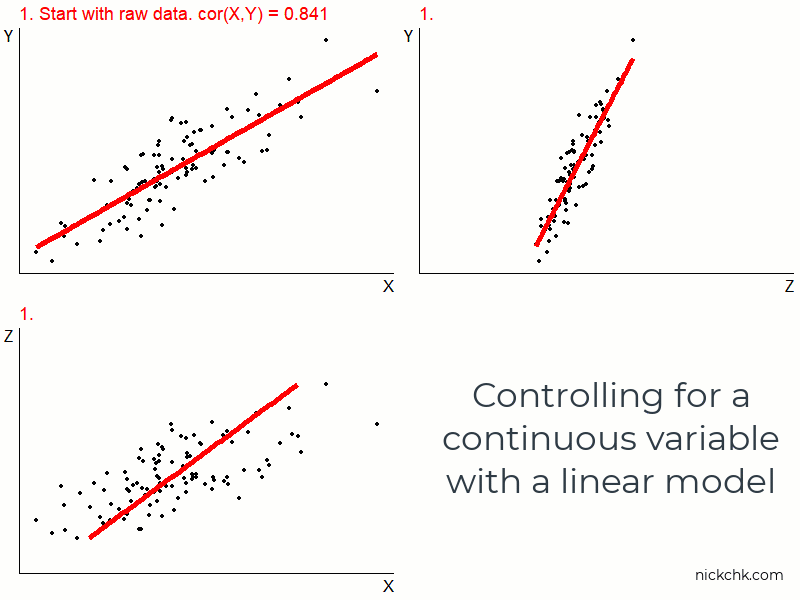

```{r setup, include=FALSE}
options(htmltools.dir.version = FALSE) 
knitr::opts_chunk$set(echo = FALSE, warning = FALSE, message = FALSE, fig.width = 8, fig.height = 6)
library(tidyverse)
library(ggthemes)
library(dagitty)
library(gganimate)
library(ggdag)
library(fixest)
library(scales)
library(Cairo)
library(magick)
# remotes::install_github('hadley/emo')
library(emo)
theme_metro <- function(x) {
  theme_classic() + 
  theme(panel.background = element_rect(color = '#FAFAFA',fill='#FAFAFA'),
        plot.background = element_rect(color = '#FAFAFA',fill='#FAFAFA'),
        text = element_text(size = 16),
        axis.title.x = element_text(hjust = 1),
        axis.title.y = element_text(hjust = 1, angle = 0))
}
theme_void_metro <- function(x) {
  theme_void() + 
  theme(panel.background = element_rect(color = '#FAFAFA',fill='#FAFAFA'),
        plot.background = element_rect(color = '#FAFAFA',fill='#FAFAFA'),
        text = element_text(size = 16))
}
theme_metro_regtitle <- function(x) {
  theme_classic() + 
  theme(panel.background = element_rect(color = '#FAFAFA',fill='#FAFAFA'),
        plot.background = element_rect(color = '#FAFAFA',fill='#FAFAFA'),
        text = element_text(size = 16))
}
```

# Endogeneity

- Last week was all about handling sampling variation and avoiding inference error
- This week we're all about endogeneity!
- Where it pops up and what we can do about it 
- At least as a starter (we'll revisit this topic many times)

---

# Endogeneity Recap

- We believe that our true model looks like this:

$$Y = \beta_0 + \beta_1X+\varepsilon$$

- Where $\varepsilon$ is *everything that determines $Y$ other than $X$*
- If $X$ is related to some of those things, we have endogeneity
- Estimating the above model by OLS, it will mistake the effect of those *other* things for the effect of $X$, and our estimate of $\hat{\beta}_1$ won't represent the true $\beta_1$ no matter how many observations we have

---

# Endogeneity Recap

- For example, the model

$$IceCreamEating = \beta_0 + \beta_1ShortsWearing + \varepsilon$$

- The true $\beta_1$ is probably $0$. But since $Temperature$ is in $\varepsilon$ and $Temperature$ is related to $ShortsWearing$, OLS will mistakenly assign the effect of $Temperature$ to the effect of $ShortsWearing$, making it look like there's a positive effect when there isn't one
- If $Temperature$ hangs around $ShortsWearing$, but OLS doesn't know about it, OLS will give $ShortsWearing$ all the credit for $Temperature$'s impact on $IceCreamEating$
- Here we're mistakenly finding a positive effect when the truth is $0$, but it could be anything - negative effect when truth is $0$, positive effect when the truth is a bigger/smaller positive effect, negative effect when truth is positive, etc. etc.

---

# To the Rescue

- One way we can solve this problem is through the use of *control variables* 
- What if $Temperature$ *weren't* in $\varepsilon$? Then we'd be fine! OLS would know how to separate out its effect from the $ShortsWearing$ effect. How do we take it out? Just put it in the model directly!

$$IceCreamEating = \beta_0 + \beta_1ShortsWearing + \beta_2Temperature + \varepsilon$$

- Now we have a *multivariable* regression model. Our estimate $\hat{\beta}_1$ will *not* be biased by $Temperature$ because we've controlled for it

<span style = "font-size: small">(probably more accurate to say "covariates" or "variables to adjust for" than "control variables" and "adjust for" rather than "control for" but hey what are you gonna do, "control" is standard)</span>

---

# To the Rescue

- So the task of solving our endogeneity problems in estimating $\beta_1$ using $\hat{\beta}_1$ comes down to us *finding all the elements of $\varepsilon$ that are related to $X$ and adding them to the model*
- As we add them, they leave $\varepsilon$ and hopefully we end up with a version of $\varepsilon$ that is no longer related to $X$
- If $cov(X,\varepsilon) = 0$ then we have an unbiased estimate!
- (of course, we have no way of checking if that's true - it's based on what we think the data generating process looks like)

---

# How?

- How does this actually work?
- Controlling for a variable works by *removing variation in $X$ and $Y$ that is explained by the control variable*
- So our estimate of $\hat{\beta}_1$ is based on *just the variation in $X$ and $Y$ that is unrelated to the control variable*
- Any accidentally-assigning-the-value-of-Temperature-to-ShortsWearing can't happen because we've removed the effect of $Temperature$ on $ShortsWearing$ as well as the effect of $Temperature$ on $IceCreamEating$
- We're asking at that point, *holding $Temperature$ constant*, i.e. *comparing two different days with the same $Temperature$ *, how is $ShortsWearing$ related to $IceCreamEating$?
- We know we're comparing within the same $Temperature$ because we literally subtracted out all the $Temperature$ differences!

---

# Example

The true effect is $\beta_1 = 3$. Notice $Z$ is binary and is related to $X$ and $Y$ but isn't in the model!

```{r, echo = FALSE}
set.seed(12315)
```

```{r, echo = TRUE}
tib <- tibble(Z = 1*(rnorm(1000) > 0)) %>%
  mutate(X = Z + rnorm(1000)) %>%
  mutate(Y = 2 + 3*X + 2*Z + rnorm(1000))
feols(Y~X, data = tib) %>%
  etable()
```

---

# Example

To remove what part of $X$ and $Y$ is explained by $Z$, we can get the mean of $X$ and $Y$ by values of $Z$

```{r, echo = TRUE}
tib <- tib %>%
  group_by(Z) %>% 
  mutate(Y_mean = mean(Y), X_mean = mean(X))
head(tib)
```

---

# Example

Now, `Y_mean` and `X_mean` are the mean of `Y` and `X` for the values of `Z`, i.e. the part of `Y` and `X` *explained by `Z`*. So subtract those parts out to get *residuals* `Y_res` and `X_res`!

```{r, echo = TRUE}
tib <- tib %>%
  mutate(Y_res = Y - Y_mean, X_res = X - X_mean)
head(tib)
```

---

# Example

What do we get now?

```{r, echo = TRUE}
feols(Y_res ~ X_res, data = tib) %>%
  etable()
```


---

# Example

Compare this to actually including `Z` as a control:

```{r, echo = TRUE}
feols(Y ~ X + Z, data = tib) %>%
  etable()
```

---

# Graphically

```{r, echo=FALSE, fig.width=5, fig.height=4.5}
df <- data.frame(Z = as.integer((1:200>100))) %>%
  mutate(X = .5+2*Z + rnorm(200)) %>%
  mutate(Y = -.5*X + 4*Z + 1 + rnorm(200),time="1") %>%
  group_by(Z) %>%
  mutate(mean_X=mean(X),mean_Y=mean(Y)) %>%
  ungroup()

#Calculate correlations
before_cor <- paste("1. Start with raw data. Correlation between X and Y: ",round(cor(df$X,df$Y),3),sep='')
after_cor <- paste("6. Correlation between X and Y controlling for Z: ",round(cor(df$X-df$mean_X,df$Y-df$mean_Y),3),sep='')


#Add step 2 in which X is demeaned, and 3 in which both X and Y are, and 4 which just changes label
dffull <- rbind(
  #Step 1: Raw data only
  df %>% mutate(mean_X=NA,mean_Y=NA,time=before_cor),
  #Step 2: Add x-lines
  df %>% mutate(mean_Y=NA,time='2. Figure out what differences in X are explained by Z'),
  #Step 3: X de-meaned 
  df %>% mutate(X = X - mean_X,mean_X=0,mean_Y=NA,time="3. Remove differences in X explained by Z"),
  #Step 4: Remove X lines, add Y
  df %>% mutate(X = X - mean_X,mean_X=NA,time="4. Figure out what differences in Y are explained by Z"),
  #Step 5: Y de-meaned
  df %>% mutate(X = X - mean_X,Y = Y - mean_Y,mean_X=NA,mean_Y=0,time="5. Remove differences in Y explained by Z"),
  #Step 6: Raw demeaned data only
  df %>% mutate(X = X - mean_X,Y = Y - mean_Y,mean_X=NA,mean_Y=NA,time=after_cor))

p <- ggplot(dffull,aes(y=Y,x=X,color=as.factor(Z)))+geom_point()+
  geom_vline(aes(xintercept=mean_X,color=as.factor(Z)))+
  geom_hline(aes(yintercept=mean_Y,color=as.factor(Z)))+
  guides(color=guide_legend(title="W"))+
  scale_color_colorblind()+
  labs(title = 'The Relationship between Y and X, Controlling for  Z \n{next_state}')+
  transition_states(time,transition_length=c(12,32,12,32,12,12),state_length=c(160,100,75,100,75,160),wrap=FALSE)+
  theme_metro() +
  ease_aes('sine-in-out')+
  exit_fade()+enter_fade()

animate(p,nframes=200)
```

---

# Controlling

- We achieve all this just by adding the variable to the OLS equation!
- We can, of course, include more than one control, or controls that aren't binary
- Use OLS to predict $X$ using all the controls, then take the residual (the part not explained by the controls)
- Use OLS to predict $Y$ using all the controls, then take the residual (the part not explained by the controls)
- Now do OLS of just the $Y$ residuals on just the $X$ residuals

---

# A Continuous Control

```{r, out.width="750px"}

```

---

# What do we get?

- We can remove some of the relationship between $X$ and $\varepsilon$
- Potentially all of it, making $\hat{\beta}_1$ us an *unbiased* (i.e. correct on average, but sampling variation doesn't go away!) estimate of $\beta_1$
- Maybe we can also get some estimates of $\beta_2$, $\beta_3$... but be careful, they're subject to the same identification and endogeneity problems!
- Often in econometrics we focus on getting *one* parameter, $\hat{\beta}_1$, exactly right and don't focus on parameters we haven't put much effort into identifying

---

# Concept Checks

- Selene is a huge bore at parties, but sometimes brings her girlfriend Donna who is super fun. If you regressed $PartyFunRating$ on $SeleneWasThere$ but not $DonnaWasThere$, what would the coefficient on $SeleneWasThere$ look like and why?
- Describe the steps necessary to estimate the effect of $Exports$ on $GrowthRate$ while controlling for $AmountofConflict$ (a continuous variable). There are three "explain/regress" steps and two "subtract" steps.
- If we estimate the same $\hat{\beta}_1$ with or without $Z$ added as a control, does that mean we have no endogeneity problem? What *does* it mean exactly?

---

# Have We Solved It?

- Including controls for every part of (what used to be) $\varepsilon$ that is related to $X$ clears up any endogeneity problem we had with $X$
- So... when we add a control, does that do it? How do we know?
- Inconveniently, the data alone will never tell us if we've solved endogeniety
- We can't just check $X$ against the remaining $\varepsilon$ because we never *see* $\varepsilon$ - what we have left over after a regression is the real-world *residual*, not the true-model *error*

---

# Causal Diagrams

- "What do I have to control for to solve the endogeneity problem" is an important and difficult question!
- To answer it we need to think about the data-generating process
- One way to do that is to draw a *causal diagram*
- A causal diagram describes the variables responsible for generating data and how they cause each other
- Once we have written down our diagram, we'll know what we need to control for
- (hopefully we have data on everything we need to control for! Often we don't)

---

# Drawing a Diagram

- Endogeneity is all about the *alternate reasons why* two variables might be related *other than the causal effect you want
- We can represent *all* the reasons two variables are related with a diagram
- Put down on paper how you think the world works, and where you think the data came from! This is economic modeling but with less math

1. List out all the variables relevant to the DGP (including the ones we can't measure or put our finger on!)
2. Draw arrows between them reflecting what causes what else
3. List all the paths from $X$ to $Y$ - these paths are reasons why $X$ and $Y$ are related!
4. Control for at least one variable on each path you *want to close* (isn't the effect you want)

---

# Drawing a Diagram

```{r, dev = 'CairoPNG'}
dag <- dagify(IceCreamEating~ShortsWearing+Temperature,
              ShortsWearing~Temperature,
              coords=list(
                x=c(IceCreamEating = 3, ShortsWearing = 1, Temperature = 2),
                y=c(IceCreamEating = 1, ShortsWearing = 1, Temperature = 2)
              )) %>% tidy_dagitty()
ggdag_classic(dag,node_size=20) + 
  theme_void_metro() + 
  expand_limits(x=c(.5,3.5))

```

---

# Drawing a Diagram

- We observe that, in the data, $ShortsWearing$ and $IceCreamEating$ are related. Why?
- Maybe, we theorize, that wearing shorts causes you to eat ice cream ( $ShortsWearing \rightarrow IceCreamEating$ )
- However, there's another explanation/path: $Temperature$ causes both ( $ShortsWearing \leftarrow Temperature \rightarrow IceCreamEating$ )
- We need to control for temperature to *close this path!*
- Once it's closed, the only path left is $ShortsWearing \rightarrow IceCreamEating$, so if we *do* see a relationship still in the data, we know we've identified the causal effect

---

# Detailing Paths

- The goal is to list all the paths that go from the *cause* of our choice to the *outcome* variable (no loops)
- That way we know what we need to control for to close the paths!
- Control for any one variable on the path, and suddenly there's no variation from that variable any more - the causal chain is broken and the path is closed!
- A path counts no matter which direction the arrows point on it (the arrow direction matters but we'll get to that next time)
- If the path isn't part of what answers our research question, it's a *back door* we want to be closed

---

# Preschool and Adult Earnings

Does going to preschool improve your earnings as an adult?

```{r, dev = 'CairoPNG'}
dag <- dagify(Earnings ~ Preschool + Skills + Parents + Location + Background,
              Skills ~ Preschool + Parents + Background,
              Preschool ~ Parents + Location + Background,
              coords=list(
                x=c(Earnings = 3, Preschool = 1, Skills = 2, Background = 2, Location = 2),
                y=c(Earnings = 1, Preschool = 1, Skills = 2, Background = 3, Location = 0)
              )) %>% tidy_dagitty()
ggdag_classic(dag,node_size=10) + 
  theme_void_metro() + 
  expand_limits(x=c(.5,3.5))

```

---

# Paths

1. $Preschool \rightarrow Earnings$
2. $Preschool \rightarrow Skills \rightarrow Earnings$
3. $Preschool \leftarrow Location \rightarrow Earnings$
4. $Preschool \leftarrow Background \rightarrow Earnings$
5. $Preschool \leftarrow Background \rightarrow Skills \rightarrow Earnings$
6. $Preschool \rightarrow Skills \leftarrow Background \rightarrow Earnings$

---

# Closing Paths

- We want the ways that $Preschool$ causes $Earnings$ - that's the first two, $Preschool \rightarrow Earnings$ and $Preschool \rightarrow Skills \rightarrow Earnings$
- The rest we want to close! They're *back doors*
- $Location$ is on #3, so if we control for $Location$, 3 is closed
- $Background$ is on the rest, so if we control for $Background$, the rest are closed
- So if we estimate the below OLS equation, $\hat{\beta}_1$ will be unbiased!

$$Earnings = \beta_0 + \beta_1Preschool + \beta_2Location + \beta_3Background+\varepsilon$$

---

# And the Bad News...

- This assumes that *the model we drew was accurate*. Did we leave any important variables or arrows out? Think hard!
- What other variables might belong on this graph? Would they be on a path that gives an alternate explanation? 
- Just because we *say* that's the model doesn't magically make it the *actual model!* It needs to be right! Use that economic theory and common sense to think about missing parts of the graph
- Also, *can* we control for those things? What would it mean to assign a single number for $Background$ to someone? Or if we're representing $Background$ with multiple variables - race, gender, parental income, etc., how do we know if we've fully covered it?

---

# And the Bad News...

- Regardless, this is the kind of thinking (whether or not you do that thinking *with a causal diagram*) we have to do to figure out how to identify things by controlling for variables
- There's no way to get around having to make these sorts of assumptions if we want to identify a causal effect
- Really! No way at all! Even experiments have assumptions
- The key is not avoiding assumptions, but making sure they're reasonable, and verifying those assumptions where you can

---

# An Example

- Let's back off of those concerns a moment and generate the data ourselves so we know the truth!
- In the below data generating process, what is the true effect of $X$ on $Y$?
- Let's figure out how to draw the causal diagram for this data generating process!
- (note: `U1`, `U2`, etc., often stand in as an unobserved common cause for two variables that are *correlated* but we think neither causes the other)

```{r, echo = FALSE}
set.seed(1234)
```


```{r, echo = TRUE}
tib2 <- data.frame(U1 = rnorm(1000), A = rnorm(1000), B = rnorm(1000)) %>%
  mutate(C = U1 + rnorm(1000), D = U1 + rnorm(1000)) %>%
  mutate(X = A + C + rnorm(1000)) %>%
  mutate(Y = 4*X + A + B + D + rnorm(1000))
m1 <- feols(Y~X, data = tib)
coef(m1)
```

---
  
# The Diagram
  
- Here's the diagram we can draw from that information. What paths are there from `X` to `Y`?

```{r, dev = 'CairoPNG'}
dag <- dagify(Y~X+A+B+D,
              X~A+C,
              C~U1,
              D~U1,
              coords=list(
                x=c(X = 1, Y = 3, A = 2, B = 3, D = 2.5, C = 1, U1 = 1.5),
                y=c(X = 1, Y = 1, A = 2, B = 2, D = 2.5, C = 2.5, U1 = 3)
              )) %>% tidy_dagitty()
ggdag_classic(dag,node_size=10) + 
  theme_void_metro() + 
  expand_limits(x=c(.5,3.5))

```

---

# The Paths

1. $X \rightarrow Y$
2. $X \leftarrow A \rightarrow Y$
3. $X \leftarrow C \leftarrow U_1 \rightarrow D \rightarrow Y$

What do we *need* to control for to close all the paths we don't want? Assume we can't observe (and so can't control for) $U_1$
  
---
  
# The Adjusted Analysis
  
- Remember, the true $\beta_1$ was 4

```{r}
m2 <- feols(Y~X + A + C, data = tib2)
m3 <- feols(Y~X + A + D, data = tib2)
etable(m1,m2,m3)
```

---
  
# Concept Checks
  
- Why did we only need to control for $C$ *or* $D$ in that last example?
- Draw a graph with five variables on it: $X$, $Y$, $A$, $B$, $C$. Then draw arrows at them completely at random (except to ensure there's no "loop" where you can follow an arrow path from arrow base to head and end up where you started). Then list every path from $X$ to $Y$ and say what you'd need to control for to identify the effect
- What would you need to control for to estimate the effect of "drinking a glass of wine a day" on "lifespan"? Draw a diagram.
                                                                                                                    