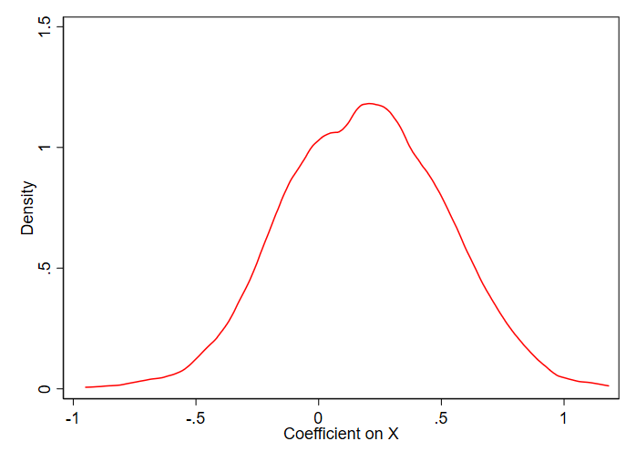
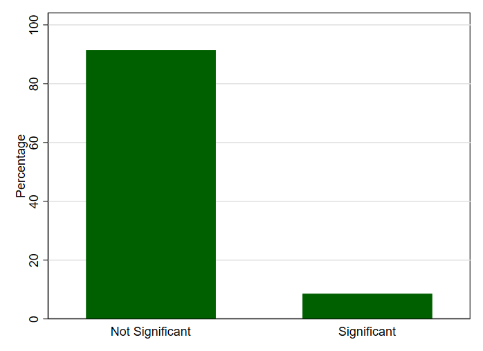

```{r setup, include=FALSE}
knitr::opts_chunk$set(echo = TRUE, message = FALSE, warning = FALSE)
library(Statamarkdown)
```

## Statistical Power

Statistics is an area where the lessons of children's television are more or less true: if you try hard enough, anything is possible.

It's also an area where the lessons of violent video games are more or less true: if you want to solve a really tough problem, you need to bring a whole lot of firepower (plus, a faster computer can really help matters).

Once we have our study design down, there are a number of things that can turn statistical analysis into a fairly weak tool and make us less likely to find the truth:

1. Really tiny effects are really hard to find (good luck seeing an electron without a super-powered microscope)
1. Most statistical analyses are about looking at variation. If there's little variation in the data, we won't have much to go on
1. If there's a lot of stuff going on *other than the effect we're looking for*, it will be hard to pull the signal from the noise
1. If we have *really high standards* for what counts as evidence, then a lot of good evidence is going to be ignored so we need *more* evidence to make up for it

Conveniently, all of these problems can be solved by increasing our firepower, by which I mean sample size. **Power analysis** is our way of figuring out exactly how much firepower we need to bring. If it's more than we're willing to provide, we might want to turn around and go back home.

Power analysis can be a great idea no matter what kind of study you're running. However, it's especially helpful in two cases:

1. If you're looking for an effect that you think is probably not *that* central or important to what's going on, i.e. it's a small effect, or a part of a system where a lot of other stuff is going on (roughly you can think of this as "a small $R^2$") a power analysis can be a great idea - the sample size required to learn something useful about a small effect is often much bigger than you expect, and it's good to learn that now rather than after you've already done all the work
1. If you're running a randomized experiment, you actually have some control over your sample size - you can choose how much data to collect, and how to randomize the treatment. A power analysis is vital before running an experiment so you don't get to the end and realize "oh dang, I probably should have done it with a few hundred more people... too late now!"

In this document we'll talk about power analysis in general and how it's done, and then we'll go into how to perform a power analysis using simulation in R, making use of tools from the **tidyverse**.

## What Power Analysis Does

Using $X$ as shorthand for the treatment and $Y$ as shorthand for the outcome, assuming we're doing a power analysis for the a study of the relationship between $X$ and $Y$, power analysis balances five things:

1. The size of the effect (coefficient in a regression, a correlation, a Cohen's $d$, etc., etc.)
1. The amount of variation in the treatment (the variance of $X$, say)
1. The amount of *other* variation in $Y$ (the $R^2$, or the variation from the residual after explaining $Y$ with $X$, or just the variation in $Y$)
1. Statistical precision (the standard error of the estimate, statistical power, i.e. the true-positive rate)
1. The sample size


A power analysis holds four of these constant and tells you what the fifth can be. So, for example, it might say "if we think the effect is probably A, and there's B variation in $X$, and there's C variation in $Y$ unrelated to $X$, and you want to have at least a D% chance of finding an effect if it's really there, then you'll need a sample size of at least E." This tells us the *minimum sample size* necessary to get sufficient statistical power.

Or we can go in other directions. "If you're going to have a sample size of A, and there's B variation in $X$, and there's C variation in $Y$ unrelated to $X$, and you want to have at least a D% chance of finding an effect if it's really there, then the effect must be at least as large as E." This tells us the *minimum detectable effect*, i.e. the smallest effect you can hope to have a chance of reasonably measuring given your sample size.

How about that "statistical precision" option? Usually, you have a target level of *statistical power* (thus the name "power analysis"). Statistical power is the true-positive rate. That is, if there's truly an effect there, and sampling variation means that you have an 80% chance of rejecting the null of no-effect in a given sample, then you have 80% statistical power. Statistical power is dependent on the kind of test you're running, too - if you are doing a hypothesis test at the 95% confidence level, you're more likely to reject the null (and thus will have higher statistical power) than if you're doing a hypothesis test at the 99% confidence level. The more careful you are about false positives, the more likely you are to get a false negative. So there's a tradeoff there.

Power analyses don't have to be run with statistical power in mind. In fact, you don't necessarily need to think about things in terms of "the ability to reject the null", which is what statistical power is all about. You could run your power analysis with any sort of statistical precision as a goal, like standard errors. Given A, B, and C, what sample size D do you need to make your standard errors E or smaller?

(as an aside, simulation is also great for checking stuff *other* than power - how about try using it to check whether your estimate is biased on average? Barely any different from the instructions on this page, just store the difference between the estimate and the truth and see what that looks like over a bunch of interations!)

### Where Do Those Numbers Come From?

In order to do power analysis, you need to be able to fill in the values for four of those five pieces, so that power analysis can tell you the fifth one. How do we know those things?

We have to make the best guesses we can. We can use previous research to try to get a sense of how big the effect is likely to be, or how much variation there's likely to be in $X$. If there's no prior research, do what you can - think about what is likely to be true, make educated guesses. Power analysis at a certain level requires some guesswork. 

Other pieces aren't about guesses but about standards. How much statistical power do you want? The higher your statistical power, the less chance there is of missing a true effect. But that means your sample size needs to go up a lot. Often people use a rule of thumb here. In the past, a goal of 80% statistical power has been standard. These days I see 90% a lot more often.

In practical terms, power analysis isn't a homework assignment, it's guidance. It doesn't need to be exact. A little guesswork (although ideally as little as possible) is necessary. After all, even getting the minimum sample size necessary doesn't guarantee your analysis is good, it just gives you a *pretty good chance* of finding a result if it's there. Often, people take the results of their power analysis as a baseline and then make sure to overshoot the mark, under the assumption they've been too conservative. So don't worry about being *accurate*, just try to make the numbers in the analysis *close enough to be useful*.

## Doing Power Analysis with a Calculator

If the analysis you're planning to do is a standard one, you can use one of many, many available "power analysis calculators" to do the work for you. Two that I happen to like are [PowerandSampleSize](http://powerandsamplesize.com) (which I use when I want to just get a quick rough answer) or [G*Power](https://www.psychologie.hhu.de/arbeitsgruppen/allgemeine-psychologie-und-arbeitspsychologie/gpower.html) (which I use when I'm working on something serious). There are also plenty of functions for doing power analysis calculations in Stata directly, like `power twomeans` (or just Google "power analysis Stata"). 

This can be great - as long as you can get your assumptions in terms the calculator understands (if you're an economist, translating your regression coefficients into something G*Power understands can be a bit of a headache), it will tell you the results.

On the downside, there are a *lot* of different statistical analyses, and a power calculator needs to be calibrated differently for every different kind of analysis. So it's likely that, unless you're doing something pretty standard (like a basic two-group randomized trial), the calculator might not cover your particular case.

Thankfully, we have another completely flexible tool available to us, that also requires less translation: simulation!

## Doing Power Analysis with Simulation

Maybe it's just because I'm really familiar with running simulations in general, but I find simulation to be a much easier way to do power analysis than working with a calculator a lot of the time.

What do I mean by doing power analysis with simulation? Well, the idea of a power analysis is that (a) for data with certain properties (variance of $X$, size of the effect, etc.), (b) and a certain analytic method (regression, etc.), (c) we are making some claim about the sampling variation of the estimator (statistical power, size of standard errors, etc.).

What better way to make sure our data has the properties we think it does, perform the exact analysis we plan to perform, and see the sampling variation than to *make up our own data with those properties, perform the analysis, and do it a bunch of times so we can see the sampling variation*? This is how simulated power analysis works.

### Step 1: Make Up Data With The Properties We Want

There are a lot of functions you can use to generate random data in Stata (see `help Random-number functions`). I generally make use of only a few: `rnormal()` to generate normally-distributed data, `runiform()` to generate uniformly-distributed data, and `runiformint()` (or various transformations of `runiform()`) to generate categorical or binary data.

`rnormal()` takes two arguments: the mean and the standard deviation. `rnormal(0, 3)` produces random normal draws from a normal distribution with a mean of 0 and a standard deviation of 3.

`runiform()` takes arguments: the start and the end of the distribution. `runiform(1, 3)` produces random uniform draws from a uniform distribution that goes from 1 to 3.

`runiformint()` is like `runiform()` except that it only produces integers, which can be handy for creating categorical data. `g treated = runiformint(0,1)` generates a bunch of values that are equally likely to be 0 (untreated) or 1 (treated). You can follow that up with some value labels (see `help label def` and `help label values` if you want to get fancy). If you want the categories to have unequal probabilities, you can instead do something like `g treated = runiform() < .2`, which will be 1 20% of the time and 0 80% of the time, or `g random = runiform()` followed by `g category = 1 if random < .2` and `replace category = 2 if random >= .2 & random < .5` and `replace category = 3 if missing(category)` to be 1 20% of the time, 2 30% of the time, and 3 50% of the time, and so on.

You can then design whatever sort of data you like - the data generating process is in your hands! You can use variables generated using random data to create *other* variables as well - now you have a causal link!

For example, let's construct a uniformly-distributed treatment variable from 0 to 1 $X$ (perhaps $X$ is "the share of students in this classroom that are left-handed), and let's say that a one-unit change in $X$ causes a $.2$ change in $Y$ (perhaps "the number of left-handed scissors in the room").

```{stata, echo = FALSE, collectcode = TRUE}
set seed 1000
```

```{stata, collectcode = TRUE, echo = FALSE, cleanlog = FALSE}
* Set the number of observations we want in our simulated data
clear
set obs 1000

* Create our data
* Note 0 and 1 are the default start and end of runiform; I want that, so I don't put anything inside runiform()
* g is short for generate
g X = runiform()

* Now create Y based on X
* Don't forget to add additional noise!
* The *true effect* of X on Y is .2
g Y = .2*X + rnormal(0, 3)
```

Just from this construction we have set: (a) the true effect of $X$ on $Y$, (b) the amount of variation in $X$ (by the characteristics of the uniform distribution from 0 to 1, 1/12), (c) the amount of variation in $Y$ not coming from $X$ (it's a normal distribution with a standard deviation of 3), and (d) the sample size (1000).

### Step 2: Perform the Analysis We're Going to Perform

We can take this data and perform whatever analysis we like on it. Let's say we plan to regress $Y$ on $X$ using robust standard errors, so let's use those.

```{stata, collectcode = TRUE, echo = FALSE, cleanlog = FALSE}
* reg is short for regress
reg Y X, robust
```

### Step 3: Pull out the Results we Want

Now that we have our analysis performed, we're going to want to *pull the results out* so we can store them elsewhere. How can we pull out the results we want? 

First, we want to think about what it is we want to pull out. If we're interested in whether or not the result is significant, we should pull out the p-value. Maybe also the coefficient itself so we can see its distribution. Coefficients can be extracted using `_b[nameofvariable]` immediately after running the regression. Here we would want `_b[X]`. 

But how do we get out the p-value from our model, or whatever else it is we may want? Unfortunately, Stata makes you calculate the p-value yourself in these instances. But it's not too difficult. We just pull out the t-statistic with `_b[X]/_se[X]` and the degrees of freedom `e(df_r)` and run that through the t distribution calculator, getting a p-value with `2*ttail(e(df_r),abs(_b[X]/_se[X]))`

```{stata, echo = FALSE, cleanlog = FALSE}
* And if we're just interested in significance, say at the 95% level,
* we can compare the p-value to .05 and store the result as a local variable (i.e. just store the single number, not as a regular Stata variable)
local sig = 2*ttail(e(df_r),abs(_b[X]/_se[X])) <= .05
* di is short for display
di `sig'
```

### Step 4: Repeat!

Of course, this is only one generated data set. That doesn't tell us much of anything about the sampling variation! So we need to do this all a bunch of times, maybe a few thousand, and see what we get. We're just going to use the good ol' `forvalues` loop.

`forvalues iterator = start(step)end { code }` will run the code `code` a bunch of times, each time setting the `iterator` variable to a different value in from `start` to `end`, taking steps `step` at a time, until it's tried all of them, like this:

```{stata, echo = FALSE, cleanlog = FALSE}
forvalues i = 1(1)5 {
  di `i'
}
```

We're going to take all of the steps we've done so far and put them inside those curly braces `{}`. Then we're going to repeat the whole process a bunch of times!

Note that I'm adding the prefix `qui` (short for `quietly`) to the regression. I don't need to see the output, so don't show it to me!

```{stata, eval = FALSE}
forvalues i = 1(1)500 {
  * Set the number of observations we want in our simulated data
  clear
  set obs 1000
  
  * Create our data
  g X = runiform()
  g Y = .2*X + rnormal(0, 3)
  
  * Run analysis quietly
  qui reg Y X, robust
  
  * Pull out results
  local sig = 2*ttail(e(df_r),abs(_b[X]/_se[X])) <= .05
  di `sig'
  local coef = _b[X]
  di `coef'
}
```

If we run this code, it will generate our data 500 times (`forvalues i = 1(1)500`) and run the analysis on each of those data sets. Then it will get the coefficient on X and whether it's significant at the 95% level and print those to screen.

Of course, this will just leave us with 500 results printed to screen. Not that useful!

### Step 5: Store the Results

So instead of printing to screen, we're going to save all of the results so we can look at them afterwards.

Now, this is a little difficult in Stata because we are going to be constantly clearing our data set to recreate new data. This means we need to store our results somewhere *other* than our data set! 

There are several ways to do this. One is to use a matrix and store the results in there. But I hate working with matrices in Stata, it's a pain. Another is to use the newfangled Stata 16 data frames. But I haven't learned to use those and you probably haven't either, if you even have Stata 16.

The way I do it is by jumping back and forth between a "results" data set and a "simulated data" data set using the `preserve` and `restore` commands. This is the kind of thing people who use other languages make fun of Stata for. But they don't even have robust SEs or marginal effects built into the base language so what do they know?

We'll start by creating a data set to store our results in. Then, as we do the analysis over and over, we will `preserve` that results data set, clear it out, do our data generation, and store our results in locals. Then we `restore` back to the results data set and put those locals in the actual variables. By the end we will have a data set full of our results!

```{stata}
clear
* We want a number of observations equal to the number of times we will simulate the data
set obs 500

* Blank variables
g coef_results = .
g sig_results = .

* Let's wrap the whole thing in quietly{} - we don't need the output!
quietly {
  forvalues i = 1(1)500 {
    
    * Preserve our results data set so we can instantly come back to it
    preserve
    
    * Set the number of observations we want in our simulated data
    * Now we're no longer in the results data set; we're in the simulated-data data set
    clear
    set obs 1000
    
    * Create our data
    g X = runiform()
    g Y = .2*X + rnormal(0, 3)
    
    * Run analysis quietly
    qui reg Y X, robust
    
    * Pull out results
    local sig = 2*ttail(e(df_r),abs(_b[X]/_se[X])) <= .05
    local coef = _b[X]
    
    * Now restore to come back to results
    restore
    
    * And store our results in the results variables, using "in" to tell it which row to store the data in
    replace coef_results = `coef' in `i'
    replace sig_results = `sig' in `i'
  }
}

* summ is short for summarize
summ sig_results
```

### Step 6: Examine the Results

Our estimate of statistical power is the proportion of the results that are significant, as shown by the `summ sig_results` at the end of the last section.

So we have statistical power of about 9%. We might also want to look at the distribution of the coefficient itself. The standard deviation of the coefficient across all the simulated runs gives you a good idea of what the standard error of the coefficient will be (which we can see with `summ coef_results`, which gives us about $\hat{\sigma}_{\beta} =$ .3).

We should probably also check the distribution directly with `tw kdensity` (`tw` is short for `twoway`) to make sure it looks appropriate and there aren't weird outliers implying a super sensitive analysis. 

```{stata, eval = FALSE}
set scheme s1color

tw kdensity coef_results, xti("Coefficient on X") yti("Density") lc(red)
```



```{stata, eval = FALSE}
label def sig 0 "Not Significant" 1 "Significant"
label values sig_results sig
graph bar, over(sig_results) yti("Percentage")
```




### Step 7: Fiddle!

The goal of power analysis isn't usually to just take one set of data-generating characteristics and generate a single power estimate, it's to do things like calculate the *minimum detectable effect* or *smallest sample size* for a given power level.

How can we do that here? By trying different values of effect size and sample size and seeing what we get.

To do this, we're first going to take everything we've done so far and wrap it inside some `foreach` loops that will set different values of whatever different things we'd like to try setting our values to.

Now we can ask what parts of the simulation we want to try fiddling with. Perhaps the effect size or the sample size (although we could do this with any part of it). So let's make those arguments of the function that we can change whenever we call it. We can list what values we want to try in the appropriate `foreach` loops

```{r, eval = FALSE}
foreach effect in .2 {
  foreach sample_size in 1000 {
    clear
    * We want a number of observations equal to the number of times we will simulate the data
    set obs 500
    
    * Blank variables
    g sig_results = .
    
    * Let's wrap the whole thing in quietly{} - we don't need the output!
    quietly {
      forvalues i = 1(1)500 {
        
        preserve
        
        clear
        * NOTICE I'm putting the "sample_size" variable from above here
        set obs `sample_size'
        
        * Create our data
        g X = runiform()
        * and the "effect" variable here
        g Y = `effect'*X + rnormal(0, 3)
        
        * Run analysis quietly
        qui reg Y X, robust
        
        * Pull out results
        local sig = 2*ttail(e(df_r),abs(_b[X]/_se[X])) <= .05
        local coef = _b[X]
        
        * Now restore to come back to results
        restore
        
        * And store our results in the results variables, using "in" to tell it which row to store the data in
        replace sig_results = `sig' in `i'
      }
    }
  }
}
```

Next we can ask what result we really want to get back. I want to know what the power is for different combinations of effect and sample size, so I just want to get back the proportion that are significant. So I'll have it report those values by doing `summ sig_results`, pulling out the mean afterwards with `r(mean)`, and putting it in a `di` command that also tells me what my `effect` and `sample_size` settings are so I know what's going on. We could also try to store those results by, for example, saving them in a matrix or writing them directly to a CSV. But for now let's just print them to the screen.

Let's stick with a sample size of 1000, but try some different effect sizes.

```{stata}
foreach effect in .4 .8 1.2 1.6 2 {
  foreach sample_size in 1000 {
    quietly {
      clear
      * We want a number of observations equal to the number of times we will simulate the data
      set obs 500
      
      * Blank variables
      g sig_results = .
      
      * Let's wrap the whole thing in quietly{} - we don't need the output!
      forvalues i = 1(1)500 {
        
        preserve
        
        clear
        * NOTICE I'm putting the "sample_size" variable from above here
        set obs `sample_size'
        
        * Create our data
        g X = runiform()
        * and the "effect" variable here
        g Y = `effect'*X + rnormal(0, 3)
        
        * Run analysis quietly
        reg Y X, robust
        
        * Pull out results
        local sig = 2*ttail(e(df_r),abs(_b[X]/_se[X])) <= .05
        local coef = _b[X]
        
        * Now restore to come back to results
        restore
        
        * And store our results in the results variables, using "in" to tell it which row to store the data in
        replace sig_results = `sig' in `i'
      }
      
      summ sig_results
      * since we're inside a quietly{} we need a noisily to see this
      noisily di "With a sample size of `sample_size' and an effect of `effect', the mean of sig_results is " r(mean)
    }
  }
}
```

So it looks like we need an effect somewhere between .8 and 1.2 to have an 80% chance of finding a significant result. If we don't think the effect is actually likely to be that large, then we need to figure out something else to do - find a bigger sample, use a more precise estimation method, something! Or else we should probably walk away.

## An Example

Let's walk quickly through an example that might commonly pop up but could be tricky to do with a power calculator.

We will have:

1. Treatment assigned *at the group level* rather than the individual level
1. A back-door/confounder variable $W$ that we will control for in analysis. The average $W$ in your group affects your probability of receiving treatment.

First, we generate data. Because of the group-level stuff this will be a bit trickier!

```{stata, echo = FALSE, collectcode = TRUE}
set seed 1000
```

```{stata, collectcode = TRUE}
clear
set obs 1000

*Let's make the confounder uniformly distributed
* 0 and 1 start/end points are default
g W = runiform()

* We can assign groups from 1 to 10, a categorical variable, using runiformint()
g group = runiformint(1,10)

* Now for the group-level assignment. First let's get group-average W since that will affect assignment
by group, sort: egen mean_W = mean(W)

* Your group is treated with a probability of .5 + mean_W/10, which we can get
* using runiform() (X > runiform() occurs with a probability of X)
g random = runiform()
* Set the random draw the same for everyone in the group
by group, sort: egen grouprandom = first(random)

g treated = .5 + mean_W/10 >= grouprandom

* let's make an outcome based on treatment and W and group
* True effect of treatment 1
g Y = 1*treated + W + group/10 + rnormal()
```

Next, we run the analysis and pull out our result of interest. Here we're again going to go for power, so we'll pull significance again, and testing at the 99% confidence level.

```{stata, echo = FALSE, cleanlog = FALSE}
reg Y treated W

local sig = 2*ttail(e(df_r),abs(_b[treated]/_se[treated])) <= .01

di `sig'
```

Now we wrap the whole thing in a loop.

```{stata, eval = FALSE}
foreach effect in 1 {
  foreach sample_size in 1000 {
    quietly {
      clear
      * We want a number of observations equal to the number of times we will simulate the data
      set obs 500
      
      * Blank variables
      g sig_results = .
      
      * Let's wrap the whole thing in quietly{} - we don't need the output!
      forvalues i = 1(1)500 {
        
        preserve
        
        clear
        * NOTICE I'm putting the "sample_size" variable from above here
        set obs `sample_size'

        * NOTICE that the part I'm changing relative to before starts here...
        *Let's make the confounder uniformly distributed
        * 0 and 1 start/end points are default
        g W = runiform()
        
        * We can assign groups from 1 to 10, a categorical variable, using runiformint()
        g group = runiformint(1,10)
        
        * Now for the group-level assignment. First let's get group-average W since that will affect assignment
        by group, sort: egen mean_W = mean(W)
        
        * Your group is treated with a probability of .5 + mean_W/10, which we can get
        * using runiform() (X > runiform() occurs with a probability of X)
        g random = runiform()
        * Set the random draw the same for everyone in the group
        by group, sort: egen grouprandom = first(random)
        
        g treated = .5 + mean_W/10 >= grouprandom
        
        * let's make an outcome based on treatment and W and group
        * True effect of treatment 1
        g Y = 1*treated + W + group/10 + rnormal()
        
        reg Y treated W

        local sig = 2*ttail(e(df_r),abs(_b[treated]/_se[treated])) <= .01
        *..... and ends here
        
        * Now restore to come back to results
        restore
        
        * And store our results in the results variables, using "in" to tell it which row to store the data in
        replace sig_results = `sig' in `i'
      }
      
      summ sig_results
      * since we're inside a quietly{} we need a noisily to see this
      noisily di "With a sample size of `sample_size' and an effect of `effect', the mean of sig_results is " r(mean)
    }
  }
}
```


How often are we significant here? Running from the original values gives us significance nearly 100% of the time! Almost 100% power. Maybe with an effect so large we dont even need that many observations.

(although note that this estimate might be biased... we could change this function slightly to store and then return `bias_results`, which would be the difference between `_b[treated]` and our true effect from `effect` to see whether the estimate is on average accurate)

And finally, we can see how big of a sample size we need to get power of 90%.

```{stata}
foreach effect in 1 {
  foreach sample_size in 50 100 200 300 400 500 {
    quietly {
      clear
      * We want a number of observations equal to the number of times we will simulate the data
      set obs 500
      
      * Blank variables
      g sig_results = .
      
      * Let's wrap the whole thing in quietly{} - we don't need the output!
      forvalues i = 1(1)500 {
        
        preserve
        
        clear
        * NOTICE I'm putting the "sample_size" variable from above here
        set obs `sample_size'

        * NOTICE that the part I'm changing relative to before starts here...
        *Let's make the confounder uniformly distributed
        * 0 and 1 start/end points are default
        g W = runiform()
        
        * We can assign groups from 1 to 10, a categorical variable, using runiformint()
        g group = runiformint(1,10)
        
        * Now for the group-level assignment. First let's get group-average W since that will affect assignment
        by group, sort: egen mean_W = mean(W)
        
        * Your group is treated with a probability of .5 + mean_W/10, which we can get
        * using runiform() (X > runiform() occurs with a probability of X)
        g random = runiform()
        * Set the random draw the same for everyone in the group
        by group, sort: egen grouprandom = first(random)
        
        g treated = .5 + mean_W/10 >= grouprandom
        
        * let's make an outcome based on treatment and W and group
        * True effect of treatment 1
        g Y = 1*treated + W + group/10 + rnormal()
        
        reg Y treated W

        local sig = 2*ttail(e(df_r),abs(_b[treated]/_se[treated])) <= .01
        *..... and ends here
        
        * Now restore to come back to results
        restore
        
        * And store our results in the results variables, using "in" to tell it which row to store the data in
        replace sig_results = `sig' in `i'
      }
      
      summ sig_results
      * since we're inside a quietly{} we need a noisily to see this
      noisily di "With a sample size of `sample_size' and an effect of `effect', the mean of sig_results is " r(mean)
    }
  }
}
```

Looks like we pass power of 90% with somewhere between 50 and 100 observations! That's a big effect, requiring not a whole lot of sample to unearth.

## Conclusion

So there we have it! The tricky part here is figuring out how to generate data where the variables have the properties and relationships you want them to (and things like treatment are assigned how you want). But that just takes a little practice - give it a whirl! I find simulation to answer questions about power or bias to be strangely addictive, and fun to do.

