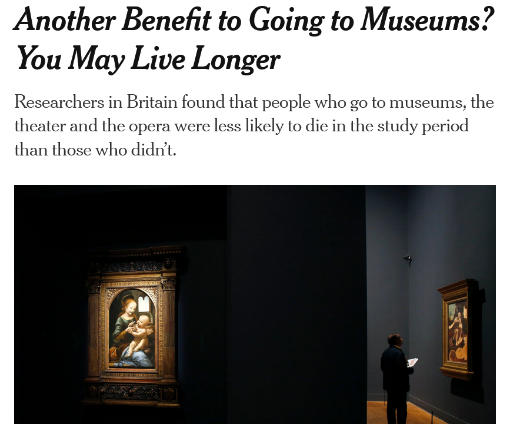

```{r setup, include=FALSE}
options(htmltools.dir.version = FALSE) 
knitr::opts_chunk$set(echo = FALSE, warning = FALSE, message = FALSE, fig.width = 8, fig.height = 6)
library(tidyverse)
library(estimatr)
library(dagitty)
library(ggdag)
library(estimatr)
library(jtools)
library(scales)
library(Cairo)
library(vtable)
theme_metro <- function(x) {
  theme_minimal() + 
  theme(panel.background = element_rect(color = '#FAFAFA',fill='#FAFAFA'),
        plot.background = element_rect(color = '#FAFAFA',fill='#FAFAFA'),
        text = element_text(size = 16),
        axis.title.x = element_text(hjust = 1),
        axis.title.y = element_text(hjust = 1, angle = 0))
}
theme_void_metro <- function(x) {
  theme_void() + 
  theme(panel.background = element_rect(color = '#FAFAFA',fill='#FAFAFA'),
        plot.background = element_rect(color = '#FAFAFA',fill='#FAFAFA'),
        text = element_text(size = 16))
}
theme_metro_regtitle <- function(x) {
  theme_minimal() + 
  theme(panel.background = element_rect(color = '#FAFAFA',fill='#FAFAFA'),
        plot.background = element_rect(color = '#FAFAFA',fill='#FAFAFA'),
        text = element_text(size = 16))
}
```

# Random experiments and causality

- Annoyingly, most things we'd like to know the effect of have back-door paths to most of the outcomes we'd like to know the effect *on*

```{r, dev = 'CairoPNG'}
dag <- dagify(Outcome ~ Treatment + AnnoyingEndogeneity,
              Treatment ~ AnnoyingEndogeneity,
              coords=list(
                x=c(Treatment = 1, AnnoyingEndogeneity = 2, Outcome = 3),
                y=c(Treatment = 1, AnnoyingEndogeneity = 2, Outcome = 1)
              )) %>% tidy_dagitty()
ggdag_classic(dag,node_size=10) + 
  theme_void_metro() + 
  expand_limits(x=c(.5,3.5))

```

---

# Random experiments and causality

- The whole idea of running an experiment is to *add another source of variation in the Treatment that has no back doors*

```{r, dev = 'CairoPNG'}
dag <- dagify(Outcome ~ Treatment + AnnoyingEndogeneity,
              Treatment ~ AnnoyingEndogeneity + Randomization,
              coords=list(
                x=c(Randomization = 0,Treatment = 3, AnnoyingEndogeneity = 4, Outcome = 5),
                y=c(Randomization = 1, Treatment = 1, AnnoyingEndogeneity = 2, Outcome = 1)
              )) %>% tidy_dagitty()
ggdag_classic(dag,node_size=10) + 
  theme_void_metro() + 
  expand_limits(x=c(-.5,2.5))

```

---

# Random experiments and causality

- If the randomization is truly random, it can't possible be related to anything on the back doors. It ONLY affects Treatment - nothing else!
- So AMONG the people who were randomized in/out of treatment, this is what the diagram looks like. Easy identification!

```{r, dev = 'CairoPNG'}
dag <- dagify(Outcome ~ Treatment ,
              Treatment ~  Randomization,
              coords=list(
                x=c(Randomization = 0,Treatment = 3,  Outcome = 5),
                y=c(Randomization = 1, Treatment = 1,  Outcome = 1)
              )) %>% tidy_dagitty()
ggdag_classic(dag,node_size=10) + 
  theme_void_metro() + 
  expand_limits(x=c(-.5,2.5))

```

---

# Example

- What is the effect of going to the opera on your health?
- Obviously this has all sorts of endogeneity - the people who go to the opera are different in many ways that also relate to health
- Income being a big one, as well as wealth, education, being healthy enough to go to a show, etc. etc. etc.
- So many back doors there's no way we could plausibly control for everything

---

# Ahem

Of course that didn't stop it from being a real study... not a *good* study, but one that got lots of attention anyway (this is the New York Times)

```{r}

```

---

# Opera

- But what if we could take a bunch of people and randomly assign them to go to the opera or not?
- Within that group of randomized people, we wouldn't expect any back doors
- Since within that group, "going to the opera" is *only* determined by random assignment. We've removed the Income $\rightarrow$ Opera, Education $\rightarrow$ Opera etc. arrows from the graph, so there are no back doors any more!
- We can easily identify the effect by comparing health among opera-goers and non-opera-goers in our randomized sample

---

# Pros and Cons of Experiments

- Experiments give us very clean identification
- Unlike controlling for stuff, we are closing back doors even for stuff we can't measure, *or don't even think of*
- And it requires fewer assumptions than things like difference-in-difference, where we're relying to some extent on assumptions about how treatment is assigned. With an experiment we *know* how treatment is assigned since we assigned it ourselves!
- (plus from a rhetorical standpoint they're very believable and easy to explain)

---

# Pros and Cons of Experiments

- On the other hand there are some difficulties with experiments that other forms of analysis don't have
- We've talked before about how experiments aren't always feasible
- They may also be less representative - if you *can* do an experiment but only on a small highly-selected group of people, your results will be *well-identified* but they won't necessarily *generalize* to the population
- That's not a trivial concern - psychology has in the past done lots of tiny experiments mainly on college students. This has led to a whole lot of results that don't replicate (because they're so small, so significant effects are often just noise), and when they do are representative of the effect *among rich-county college students* but not among everybody
- Those same problems apply to non-experimental work, it's just easier to avoid because it's easier to sample lots of different people if you don't have to do an experiment
- (although the "only studying people in rich countries" problem is way broader than just experiments)

---

# Pros and Cons of Experiments

- Another issue with experiments is that the experiment itself might change the behavior
- If people act differently because they know they're in an experiment, that's "the Hawthorne effect", named after an early social science experiment that found that people behaved differently in experimental conditions
- Further, if people have an idea of the behavior the experimenter *wants* to see, they may give it to them. This is "experimenter demand"
- Also, for a lot of experimental changes, people may adjust over time - your experiment might be great at getting people to go to the gym... but people may fall back into old habits after the data stops getting collected, even if the treatment is still in place
- In general, you have to be *very careful* that what you're getting is natural behavior, that people *understand* any questions you have to ask them, that you're really studying what you want to study
- Some of these problems can be solved with "field experiments" where people don't realize they're in an experiment and they're just behaving as normal. One example of this is when websites randomly show different versions of the site to different people and track how they respond ("A/B testing" they call it but it's just a regular ol' experiment)

---

# Pros and Cons of Experiments

- That said, despite these issues experiments are super valuable! 
- No cleaner way to get a causal effect. Hard to deny that
- We just need to be mindful of the boundaries of what experiments can give us
- As well as the procedural stuff we'll talk about here
- They're not automatically better than other methods. The problems they face are just different


---

# Performing an Experiment

1. Figure out what needs to be randomized (the treatment, usually)
1. Figure out what you want your outcome to be
1. Figure out where you'll do the experiment and how much data you need
1. Figure out *how to randomize* the treatment
1. Perform the experiment and collect data
1. Analyze the data
1. Check for threats to the experiment

---

# Treatment and Outcome

- We're going to walk through our example as though we're going to do the opera and health study as an experiment
- Of course, we want to be sure that once we do our experiment that we've actually answered the question we want to answer
- If our question is "do the arts improve health" then using opera as a treatment doesn't really answer that
- If it's "does going to the opera improve your health" that's better
- But also... we can't just measure "health" - what is our measurement? Let's get more specific and ask "does going to the opera extend your lifespan?" which was what the actual original study was about

---

# Where and How Much?

- We need an environment where we can randomize people to attend the opera or not
- and what is "or not"? That's always a question in experiments. There's no such thing as "nothing." We could leave them to do whatever they'd *choose* to do (which might be the opera, uh-oh). We could give them an alternative treatment like "sit in a blank room and stare at a wall" (but what's the effect of that?). Do we take people who already go to opera and have them go to *one more* opera?
- Not just in experiments but in all analyses of a treatment effect we always have to ask what treatment people would be otherwise getting
- Let's compare the opera to a more common entertainment activity like the movies
- We can recruit a bunch of people and randomly assign them to either go to the opera every week (which we need a budget to pay for), or send them to the movies

---

# How Much?

- We've talked before about *statistical power* - having a large enough sample that we can have a reasonable expectation of finding a result if it's there, and just generally having small enough standard errors that the results are useful
- In experiments, though, we have some control over our sample size!
- So *before* collecting any data, we need to do a *power analysis* - what sample size do we need to get our standard errors down to a useful level? 
- A power analysis has four elements: sample size, anticipated true effect, variance of the outcome, and power. Set the values of three of them based on what you anticipate to be true, and it will tell you the fourth!
- A common goal is to have a sample large enough 80% (or 90%) chance of getting a significant result of an anticipated size

---

# How Much?

- There are a lot of calculators out there that will do these actual calculations for you, like [PowerandSampleSize](http://powerandsamplesize.com) or [G*Power](https://www.psychologie.hhu.de/arbeitsgruppen/allgemeine-psychologie-und-arbeitspsychologie/gpower.html), which is what I use
- Another great method, especially with more complex experiments, is to use simulation - randomly generate data with the properties you expect your data to have, see if you find an effect, then repeat thousands of times. Proportion of times you get a significant effect = your power. Standard deviation of the effect = standard error. Look back to our lectures on sampling variation to see some examples
- I will post a guide sheet on how to use these tools

---

# How Much?

- But the general idea of power analysis is this:
- Imagine trying to see a crater on the moon with a telescope
- The bigger your telescope (bigger sample), the more fine detail and smaller craters you can see (small effects)
- You need a *lot of people* to see a *tiny effect*
- You can answer "does a parachute save your life" with two people. To answer "does this BrainPower pill raise your IQ by .000001 points" you need about eight billion
- You also need a whole lot of people to see if the *effect differs* between different groups
- Roughly, if you need X people to see an effect overall, you need **16X** people to see whether the effect differs between two groups 

---

# How Much?

- If we think that going to the opera instead of the movies will increase your lifespan by a month on average, and we are going to randomize 60-year-olds for whom the standard deviation of lifespan might be about 5 years, we are looking for an effect that is $1/(12*5) = 1/60$ of a standard deviation. Pretty small!
- Any guesses how many people we'll need to recruit to have an 80% chance of finding a significant effect when we do a hypothesis test at the 95% level?

---

# How Much?

- According to the [PowerandSampleSize](http://powerandsamplesize.com) "Compare two means two-sided inequality" calculator, we need **56,397** people in our study. To only have an 80% chance it works *if* we're right about how big the effect is! FOr a 90% chance it's 75,550. 
- Ouch.
- This is because we expect the effect to be tiny. Statistical properties of tiny effects are really bad y'all. Beware!
- Maybe we can only afford 2,000 people. Then we can ask what's the "minimum detectable effect" (MDE) - i.e., how big does the effect *need to be in truth* for us to have a good chance of finding it?
- With 2,000 people, we have an 80% chance of picking up an effect of 5.5 months or bigger. So if we can only afford a sample of 2,000, we shouldn't even bother if we think the opera has a smaller effect than that (and it almost certainly has a smaller effect than that)

---

# How Much?

- By the way, all this power analysis stuff applies to observational data/non-experimental data too, it's not specific to experiments
- We just don't do it as often because we can't control the sample size anyway, and it's easier to get huge samples
- You still huge samples to reasonably study small effects
- So don't pursue effects that are likely to be really tiny, or at least tinier than your sample can handle
- If we ran the underpowered study anyway and *do* get a significant result, it would be more likely to be a false positive than a true positive. That's low power for you!

---

# How to Randomize

- The point of randomization is that the treatment and control groups are basically the same on everything, even the stuff we can't measure
- On average, this will happen naturally if we just do random assignment for everybody with a random number generator *if our sample is large enough*
- In smaller samples we may want to give it a helping hand by randomizing *within certain groups* ("blocking") to ensure those groups are evenly distributed across treatment and control
- This is especially important if we want to compare the effect within those groups

---

# How to Randomize

- Another issue is *what level will randomization be done at*?
- Often you want to randomize each individual, but often that's not possible
- For example, if you're looking at an education intervention, you might have to randomize classrooms or schools. It might not make sense to randomize individual students
- The effective sample size is somewhere between the number of students and the number of classrooms/schools. Hard to get a "big" sample when doing this!
- Power analysis gets much tougher - in these cases you generally want to do a simulation rather than use a calculator

---

# Perform the Experiment

- Be 10000% sure before you start that the data you'll get will actually answer your question - it's super expensive to REDO an experiment. Try with some simulated data first!
- Also, ensuring the experiment is performed as intended can be very tough!
- How can we be sure that our moviegoers aren't sneaking off to the opera at night?
- Or that people show up to the opera you've assigned them to?
- Or that the team you've employed to hand out the opera and movie tickets don't mix them up?
- Or that opera-goers won't sneak their movie-goer friends into the opera?
- Or that we can actually get the lifespan data we want? Who do we get that data from? Can we trust it?


---

# Analyze the Data

- Once we have the data, it's pretty darn easy to analyze! That's the beauty of experiments
- Just compare the treated and untreated groups. Done! No back doors to close, ideally

```{r, eval = FALSE, echo = TRUE}
lm(outcome ~ treatment, data = experimentdata)
```

- Treatment is binary (or categorical if we have multiple treatments), we know how to interpret that!

---

# Threats to the Experiment

So far so good. So if we do all this, *what can go wrong* and *how can we check*?

Some things that can go wrong:

- Attrition
- Balance
- Compliance


---

# Attrition

- If your experiment has *any* gap of time between randomization into treatment and collecting the outcome, you will likely have some *attrition* from your study
- People will become uncontactable, or stop reporting data, or just generally *leave*
- This can be a problem if it happens for non-random reasons, because that reintroduced endogeneity!
- Say people don't like opera, and so people assigned to see opera are more likely to stop showing up to the experiment than people assigned to the movies. Or perhaps people with more sensitive hearing (and worse health in other ways too on average) are more likely to drop out of the opera group than the movie group
- Now your treated group represents people who were randomly assigned to treatment *and didn't dislike opera enough to leave*. That could be related to the outcome!

---

# Attrition

- What can we do about it?
- Keep in mind, what we're really concerned about is *whether attrition is different in the treated or untreated groups*
- Either *higher/lower* in treated/untreated, or *among different groups of people* in treated/untreated
- First we can *check* whether any attrition we had seems to be non-random

---

# Detecting Attrition

Create a binary variable telling us there's attrition, which we might see by not having an outcome for that individual

```{r, eval = FALSE, echo = TRUE}
experimentdata <- experimentdata %>%
  mutate(attrition = is.na(outcome))
```

Check whether it's higher/lower in the treated/untreated group:

```{r, eval = FALSE, echo = TRUE}
lm(attrition ~ treatment, data = experimentdata)
```

Check whether it's different in treated/untreated *for a specific group* - this could be some pre-experiment demographic group like gender, or could be some early outcome, like "people who rated their experience lower after the first week of the experiment"

```{r, eval = FALSE, echo = TRUE}
lm(attrition ~ treatment*gender, data = experimentdata)
```

---

# Dealing with Attrition

If we find evidence of attrition, what should we do?

- Trim the data: if, for example, we think those with the weakest outcomes are the ones attriting more in the treatment group, we could drop the actual weakest outcomes in the control group until attrition rates are equal
- Generally, trim in the direction that makes it harder to support your hypothesis
- Or, we can use a **selection model** using the "Heckman correction" which is beyond the scope of this class. But basically you treat attrition as a form of omitted variable bias, predict attrition using your controls, and use that to adjust for attrition

---

# Balance

- Sometimes, just through bad luck (and smaples smaller than infinity), randomization doesn't perfectly control for variables on the back door
- Is this a problem? Certainly can be. If it implies randomization was done improperly, that's bad. Also if you now have treatment/control differences related to variables on back doors, that's bad
- We can check with a *balance table* that compares means of control variables across treated/untreated and tests if they're different

```{r, eval = FALSE, echo = TRUE}
library(vtable)
sumtable(experimentdata, group = 'treatment', group.test = TRUE)
```

- If we see more differences than we expect (say, a lot more than 1/20 comparisons are different using a 95% test) that may indicate problems with randomization
- If we see any differences, we may want to add them as controls to the analysis if the difference is *meaningfully large* not just statistically significant

---

# Balance Tables

```{r, echo = TRUE}
data(mtcars)
sumtable(mtcars, group = 'am', group.test = TRUE)
```

---

# Balance Tables

- If that were an actual experimemnt, we'd be concerned!
- The F-test that treatment is unrelated to the background rejects the null of no difference for `mpg`, `cyl`, `disp`, `drat`, `wt`, and `gear`!  Plus, all of these differences look pretty big in absolute term
- Way more than we'd expect by chance
- (the only one that it's totally okay if it's different is the outcome variable)
- We'd (a) be concerned that randomization didn't work well here (which, of course it didn't, this isn't an actual experiment), and (b) want to add these variables as controls
- If it's just a stray one or two, adding a control is probably good. If we see LOTS of significant differences, then the randomization might have problems and we're back to worrying about back doors through variables we DIDN'T test

---

# Compliance

- When you run an experiment, you can certainly *assign* people to treatment but you can't *make them do it*
- So what happens if they don't? You might get some movie-goers sneaking out to the opera, and some opera-goers skipping it entirely, or heading to the movies instead
- That means we have *non-compliance*
- Especially a problem if it's non-random, since that brings endogeneity back in
- What can we do about that?

---

# Intention-to-treat

- If we have some noncompliance and just ignore the problem, we end up with an *intent-to-treat* (ITT) result
- Basically, it all still works, except the effect we get isn't *the effect of treatment*, it's *the effect of being assigned to treatment*, which is different
- This can still be handy, especially if treatment might be assigned the same way in the future!
- This will in general *underestimate* the effect of the treatment itself, since we include people in the "treated" category who weren't actually treated, and people in the "untreated" category who were, so the two groups get closer together. Smaller effect!

---

# Two stage least squares

- a.k.a. instrumental variables
- Or, if we can observe whether people actually received treatment (separate from us assigning it to them), we can use two-stage least squares (2SLS) to adjust the ITT so that we get the effect of actual treatment instead
- Basically, 2SLS takes the effect of assignment and scales it up by how much the treatment assignment increases the treatment rate
- If being assigned to opera increases the chances you actually go to the opera from 20% to 80%, and we see that the assigned-to-opera group lives 3 months longer, we got that 3-month effect despite only 60% additional people seeing the opera! So the effect of opera if EVERYONE had done what we said is (3 months)/(60%) = 5 months.
- Keeping in mind this is more representative of the effect *among those who respond really strongly to treatment*
- And doesn't work if people *intentionally do the opposite of what you say*
- (See the instrumental variables module for more information)

---

# Two stage least squares

- If it's more complex - you have control variables, etc., you can't just do the scaling, and actually have to perform two-stage least squares.
- Remember `lm_robust()` in `estimatr`? We conveniently also have `iv_robust()`
- If `treatment` is "actually getting treatment" and `assignment` is "being assigned to treatment" then we have

```{r, eval = FALSE, echo = TRUE}
library(estimatr)
iv_robust(outcome ~ treatment | assignment, data = experimentdata)
```

---

# Two stage least squares

- Does it actually work? Let's see!

```{r, echo = FALSE}
set.seed(2000)
```

```{r, echo = TRUE}
tb <- tibble(assignment = sample(c(TRUE,FALSE),1000, replace = TRUE)) %>%
  # Start with assignment working
  mutate(treatment = assignment) %>%
  # Randomly reassign 20% of people not based on treatment at all
  mutate(treatment = case_when(
    sample(c(TRUE,FALSE),1000,prob = c(.8,.2), replace = TRUE) ~ assignment,
    TRUE ~ sample(c(TRUE,FALSE),1000, replace = TRUE))) %>%
  # True effect is 2
  mutate(outcome = 2*treatment + 3*rnorm(1000))
# Intent-to-treat
itt <- lm_robust(outcome ~ treatment, data = tb)
# 2sls to adjust for compliance
twosls <- iv_robust(outcome ~ treatment | assignment, data = tb)
# Do the scaling by hand (since this is a simple case)
treatment_increase <- (tb %>% filter(assignment) %>% pull(treatment) %>% mean()) - (tb %>% filter(!assignment) %>% pull(treatment) %>% mean())
assignment_effect <- (tb %>% filter(assignment) %>% pull(outcome) %>% mean()) - (tb %>% filter(!assignment) %>% pull(outcome) %>% mean())
scaled <- assignment_effect/treatment_increase
```

---

# Two stage least squares

```{r, echo = TRUE}
c(assignment_effect, treatment_increase, scaled)

export_summs(itt, twosls, statistics = c(N = 'nobs'))
```

---

# Next!

To complete the module (due by the end of the second-to-last week of class):

- Do the Experiments Swirl
- Do the Experiments homework
- Read the assigned paper and answer the questions